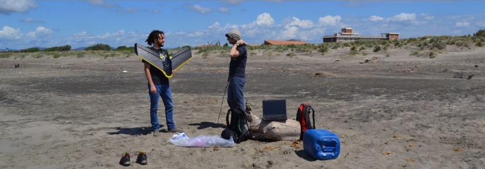

Following, some pics taken in the field. Good memories are a perfect means to talk about past experiences..

In this picture, I am with [**Marco Malavasi**](https://www.researchgate.net/profile/Marco_Malavasi), colleague (and good friend). We were taking images with an eBee drone to remotely derive topographic (e.g. elevation, slope and so on) and bio-related (e.g. NDVI) information of a nice sandy beach in Italy.
At that time, it was already from a couple of years that I was working with remote sensing data for my PhD. Indeed, my thesis focused on the integration of field-collected floristic data and remotely sensed imagery to analyse the effects of natural and anthropogenic processes on coastal dune vegetation. My PhD supervisor was Prof. Carranza ([**University of Molise, EnvixLab**](http://envixlab.unimol.it/team/)), and my co-supervisor Prof. Acosta ([**University of Roma Tre**](https://scholar.google.it/citations?user=mquEQS0AAAAJ&hl=it&oi=sra)).

Some results of the thesis:
- [**How does dune morphology shape coastal EC habitats occurrence? A remote sensing approach using airborne LiDAR on the Mediterranean coast**](https://www.sciencedirect.com/science/article/pii/S1470160X16304435)

__Spoiler__: we used LiDAR imagery to describe the morphological profile of coastal plant communities listed as EC-habitats in the European Community Habitats Directive.

- [**Multiple drivers of plant diversity in coastal dunes: A Mediterranean experience**](https://www.sciencedirect.com/science/article/pii/S0048969718341950)

__Spoiler__: we investigated which among human-related, abiotic and biotic factors mostly affect native species richness and cover on Mediterranean coastal dunes.

- [**Disentangling the effect of coastal erosion and accretion on plant communities of Mediterranean dune ecosystems**](https://www.sciencedirect.com/science/article/abs/pii/S0272771420300251)

__Spoiler__: we explored the effect of shoreline dynamics (erosion and accretion) on dune vegetation diversity.

Pic: [_Marta Gaia Sperandii_](https://www.researchgate.net/profile/Marta_Gaia_Sperandii)

Half of my PhD focused on biological invasions. Specifically, my aim was to 1) use remote sensing data to derive measures of propagule pressure, abiotic and biotic factors, which are known to simultaneously affect the outcome of any invasion event (see [___Catford et al., 2009___](https://onlinelibrary.wiley.com/doi/pdf/10.1111/j.1472-4642.2008.00521.x) for a wonderful review) and 2) use the obtain information to model the distribution of _Carpobrotus_ sp. on Mediterranean coastal dunes. Here a picture of this nice yet invasive plant, whcih is native to South Africa.

People interested can read something here:

- [**Modeling plant invasion on Mediterranean coastal landscapes: An integrative approach using remotely sensed data**](https://www.sciencedirect.com/science/article/abs/pii/S0169204617302967)

__Spoiler__: we found out that in spots of bare ground occurring at intermediate sectors of the coastal zonation, abiotic conditions are not too harsh and anthropogenic disturbance is sufficient to favor _Carpobrotus_ sp. invasion.

- [**Plant invasion risk: A quest for invasive species distribution modelling in managing protected areas**](https://www.sciencedirect.com/science/article/abs/pii/S1470160X18305788)

__Spoiler__: We proposed a species distribution model-based approach to prioritize management of invasive species in networks of protected areas.

After the PhD, I landed at Rennes (Bretagne, France) where I analysed the drivers of plant invasion in harsh sub-Antarctic islands. In the picture, I am with my good friend Rémi, with whom I shared incredible adventures on Possession Island (French sub-Antarctic islands). In this picture, we were crossing a river during a field campagin aimed at sampling data on alien species on the island.

One of the otucomes of this experience is here:

- [**Once upon a time in the south: Influence of local drivers and functional traits on plant invasion in the harsh sub-Antarctic islands**](https://doi.org/10.1111/jvs.13057)

__Spoiler__: We found out that short, perennial plants with a longer residence time were better able to colonise Possession Island (Crozet Archipelago) than tall, annual plants with a shorter residence time.
