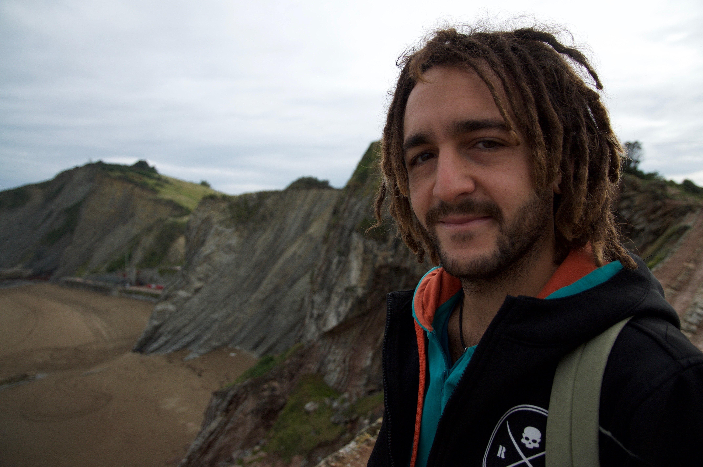

[**_CV and contacts_**](https://manuelebazzichetto.github.io/pers-website/CV/){: .btn} [**_Pics from the field_**](https://manuelebazzichetto.github.io/pers-website/PicsFromField/){: .btn}

Welcome to my personal webpage (**still under construction** :hammer: )

My name is Manuele Bazzichetto, and I am a vegetation ecologist broadly interested in:
- biological invasions
- biogeography
- species distribution modelling.

Here a picture of me (when I had long hairs  :smile: ):

As soon as I can, I will share on this web-site all things related to my research and personal interests, and some R experiment.

